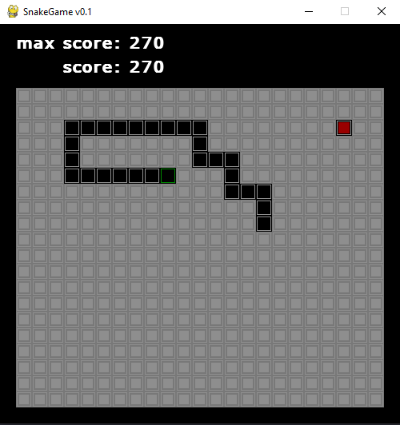
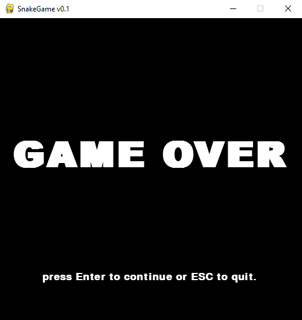

# Snake Game com PyGame<br>

jogo da cobrinha implementado em python+Pygame.




## Controles

Use :arrow_left: :arrow_right: :arrow_up: :arrow_down: para mover a snake.

Pressione o botao de uma direção por algum tempo para aumentar a velocidade.

Na tela de `Game Over` pressione `Enter` para continuar novamente ou `Esq` para sair do jogo.

# O que jogo possui?
 - controles faceis de usar.
 - um sistema basico de armazenamento de pontuações.
 - um sistema costumizavel de controle de som: 
    + escolha qualquer musica que voce possua para jogar.

Para customizar os sons edite o `sound.json`:
  - use `.mp3` para a `music`.
  - use `.wav` para `apple` e `game-over`

Um exemplo valido seria como abaixo:
```json
{
    "music":"your_music_example.mp3",
    "apple":"your_sound_effect_apple.wav",
    "game-over":"your_sound_effect_game_over.wav"
}
```
---

<p align="center">
    Copyright © 2021 <b>FranciscoCharles</b>
</p>