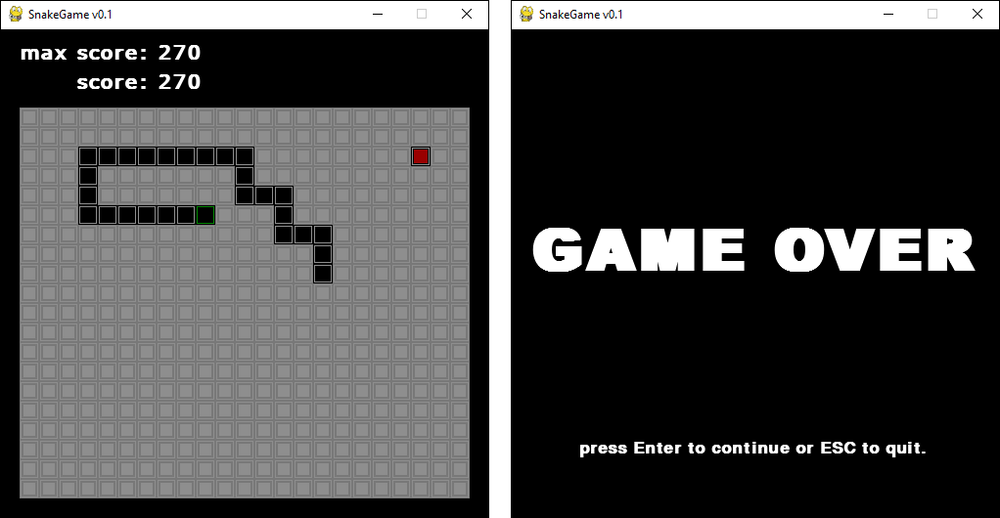

# Snake Game com PyGame<br>

Jogo da cobrinha implementado em **Python+Pygame**.



## Controles

Use :arrow_left:, :arrow_right:, :arrow_up:, :arrow_down:,<kbd>A</kbd>,<kbd>S</kbd>,<kbd>W</kbd> e <kbd>Z</kbd> para mover a snake.

Pressione o botao de direção por algum tempo para aumentar a velocidade.

Na tela de `Game Over` pressione <kbd>Enter</kbd> para jogar novamente ou <kbd>Esq</kbd> para sair do jogo.

# O que jogo possui?
 - controles faceis de usar.
 - um sistema basico de armazenamento de pontuações.
 - um sistema costumizavel de controle de som: 
    + escolha qualquer musica que voce possua para jogar.

Para customizar os sons edite o `sound.json`:
  - use `.mp3` para a `music`.
  - use `.wav` para `apple` e `game-over`, para esses efeitos utilize sons de poucos segundos de comprimento.

Um exemplo valido seria como abaixo:
```json
{
    "music":"your_music_example.mp3",
    "apple":"your_sound_effect_apple.wav",
    "game-over":"your_sound_effect_game_over.wav"
}
```

onde `your_music_example.mp3`,`your_sound_effect_apple.wav`,`your_sound_effect_game_over.wav` estão na mesma pasta do arquivo `main.py`

Você tambem pode passar o caminho completo para as musicas, como no exemplo abaixo:
```json
{
    "music":"my_path_folder/your_music_example.mp3",
    "apple":"my_path_folder/your_sound_effect_apple.wav",
    "game-over":"my_path_folder/your_sound_effect_game_over.wav"
}
```
# Como executar?

Entre na pasta `src` e execute o comando `python main.py`.

# Versão pygame
- **Pygame** == **1.9.6**

---

<p align="center">
    Copyright © 2021 <b>FranciscoCharles</b>
</p>
